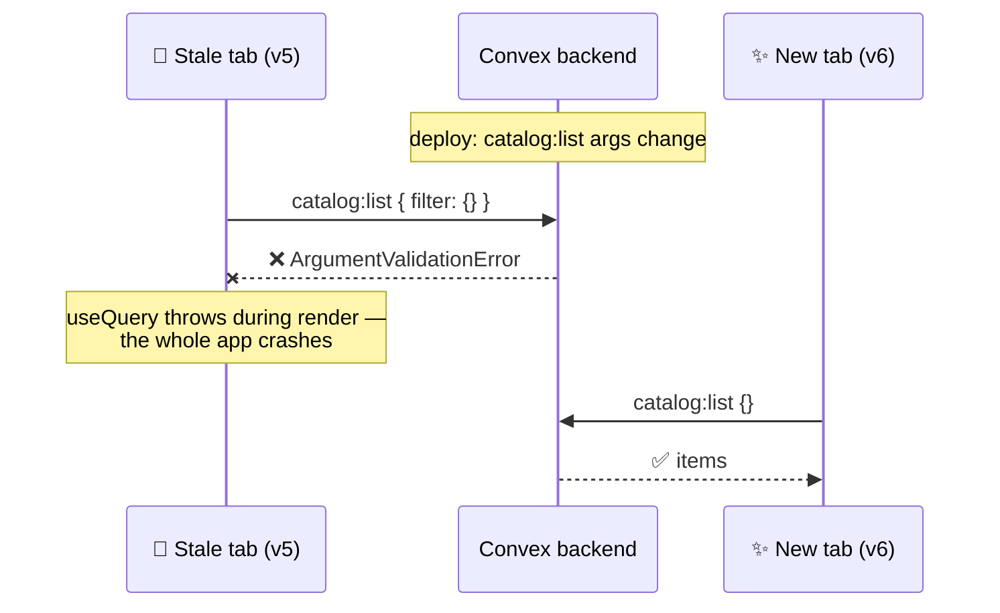
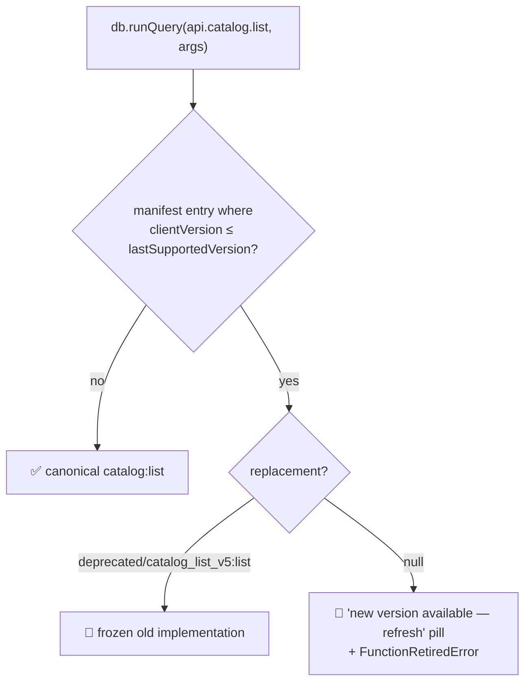
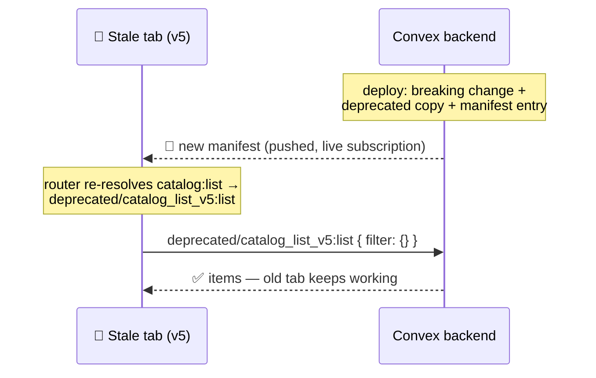

# 🏪 Shoplift

> *The general store you stock yourself. Nothing is actually for sale. Or stolen.*

**Shoplift** is a small storefront app — browse, post, and delete catalog items — built as a **testbed for a client-version-aware function routing system on [Convex](https://convex.dev)**. The store is the excuse; the interesting part is what happens when you deploy a breaking backend change while old frontends are still running in people's browser tabs.

**Stack:** Next.js 16 (App Router) · Convex (database + realtime backend) · Tailwind CSS v4 · deployed on Vercel.

---

## The problem this project explores

On Vercel, the build command is `npx convex deploy --cmd 'bun run build'` — the **Convex backend deploys before the new frontend** finishes rolling out. Meanwhile, browser tabs keep running stale bundles for hours or days.

Convex validates function arguments server-side. So the moment a function's signature changes (or the function is deleted), every stale client crashes:



Worse: Convex subscriptions are live. The server **re-runs active subscriptions on deploy**, so open tabs don't even need to do anything to break — the error is pushed to them.

## The fix: versioned function routing

Three pieces work together:

### 1. Every build knows its own version

`next.config.ts` stamps each build with `NEXT_PUBLIC_APP_VERSION = git rev-list --count HEAD` — a monotonic integer that bumps with every commit on `main` (requires `VERCEL_DEEP_CLONE=true` on Vercel, since shallow clones undercount). It's rendered as the low-opacity badge in the bottom-right corner of the app.

### 2. Old implementations are frozen, not deleted

Breaking a public function's signature follows the workflow in [`convex/deprecated/README.md`](convex/deprecated/README.md): the old implementation is copied to its own file under `convex/deprecated/`, and an entry is added to the manifest in [`convex/versions.ts`](convex/versions.ts):

```ts
{
  fn: "catalog:list",                              // canonical function
  lastSupportedVersion: 5,                         // highest client version with the OLD call shape
  replacement: "deprecated/catalog_list_v5:list",  // where those clients get routed
  deprecatedAt: "2026-06-11",
}
```

Deprecated files are tombstones with an expiry: after a few weeks, the file is dumped and `replacement` flips to `null`, which turns the version badge into a *"new version available — refresh"* pill for any ancient tab still around.

### 3. `DatabaseProvider` routes every call by client version

This is **why `DatabaseProvider` exists**. All Convex access goes through it (`useDatabase()` for one-shot `runQuery`/`runMutation`/`runAction`, `useDatabaseQuery()` for live subscriptions) — importing `convex/react` directly in app code is an ESLint error. The provider subscribes to the `versions:manifest` query and resolves every function reference through it:



The key design constraint: **a stale bundle's code is frozen at build time**, so the deprecation map can't ship inside the frontend — it has to come from the server. And because the manifest is itself a Convex subscription, a backend deploy *pushes* the new routing to every open tab over the websocket. Stale tabs reroute themselves mid-flight, no reload needed:



A small error boundary inside the provider covers the race where a subscription error beats the manifest push; it auto-resets the moment the manifest lands.

### What about removed columns?

Function routing guards *how functions are called*; deprecated function **bodies** guard *what data looks like*. A deprecated copy's signature is frozen but its body runs against the live database — so when a column is removed, the old generation's body becomes an adapter that synthesizes the missing field for old clients.

## Project map

```
convex/
  catalog.ts            ← canonical queries/mutations (list, add, remove)
  versions.ts           ← deprecation manifest + frozen versions:manifest query
  deprecated/
    README.md           ← the deprecation workflow (read before breaking anything)
    catalog_list_v1.ts  ← frozen generations of catalog:list
    catalog_list_v5.ts
    catalog_list_v6.ts
  schema.ts             ← items table + full-text search index
components/
  DatabaseProvider.tsx  ← version-aware router around the Convex client
  VersionBadge.tsx      ← version stamp / refresh prompt
app/
  page.tsx              ← the store (browse · search · post · delete)
next.config.ts          ← build-time version stamping
```

## Running locally

```bash
bun install        # or npm install
npm run dev        # convex dev watcher + next dev together
```

Local dev always reports version `0`, which routes everything to canonical functions (a dirty working tree has the newest call sites but an old commit count — routing it would mis-fire). To simulate a stale client against the current backend:

```bash
APP_VERSION_OVERRIDE=5 npm run dev   # pretend this build is version 5
```

then watch the Convex logs route `catalog:list` to `deprecated/catalog_list_v5:list`.

## Honest limitations

- Bundles deployed **before** the router existed can't be saved retroactively — protection starts with the first build that ships it.
- `lastSupportedVersion` bookkeeping assumes builds come from committed code on `main` (true on Vercel; local `next dev` opts out via version `0`).
- Versions bump per *commit*, not per *deploy* — push three commits, jump three versions. Monotonic is what matters.
